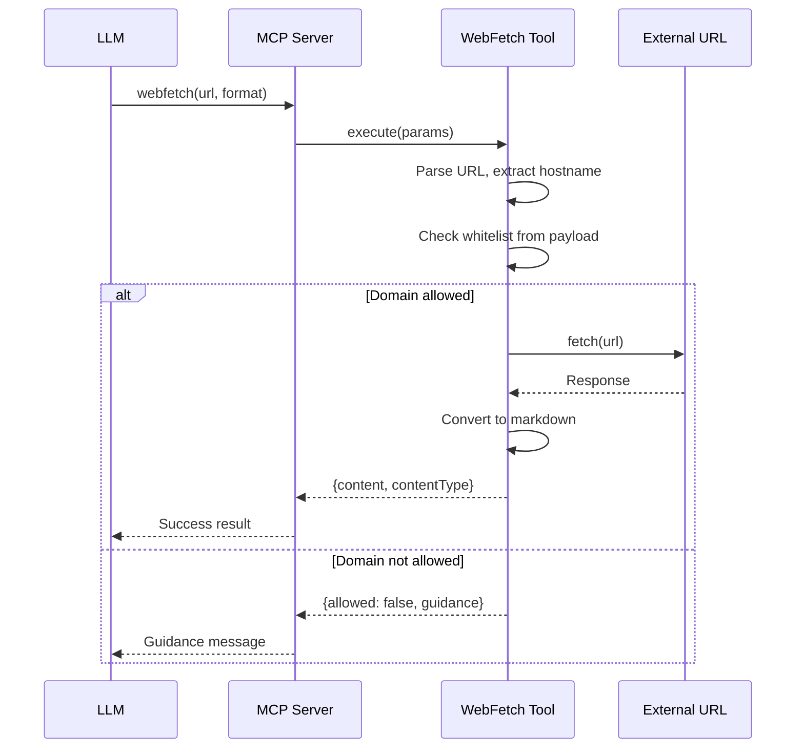

# WebFetch Tool Analysis

Analysis of webfetch/URL fetching implementations across three AI coding agents to inform the design of pullfrog's custom webfetch MCP tool.

---

## 1. OpenCode Implementation

**Source**: `packages/opencode/src/tool/webfetch.ts`

### Architecture

OpenCode's webfetch is straightforward - a simple fetch wrapper with HTML-to-markdown conversion:

```typescript
const response = await fetch(params.url, {
  signal: AbortSignal.any([controller.signal, ctx.abort]),
  headers: {
    "User-Agent": "Mozilla/5.0 (Windows NT 10.0; Win64; x64) AppleWebKit/537.36...",
    Accept: acceptHeader,
    "Accept-Language": "en-US,en;q=0.9",
  },
})
```

### Key Features

| Feature | Implementation |
|---------|---------------|
| **Output formats** | `text`, `markdown`, `html` (default: markdown) |
| **HTML→Markdown** | Uses `turndown` library |
| **Max response size** | 5MB hard limit |
| **Timeout** | 30s default, 120s max |
| **Permission system** | Application-level `ctx.ask()` prompt |
| **Domain blocking** | None - relies on user approval |
| **Caching** | None |
| **Redirect handling** | Native fetch behavior |

### HTML Processing

Two methods depending on output format:

1. **`extractTextFromHTML()`** - Uses Bun's `HTMLRewriter` to strip scripts/styles and extract text
2. **`convertHTMLToMarkdown()`** - Uses `turndown` with sensible defaults (ATX headings, fenced code blocks)

### Permission Model

```typescript
await ctx.ask({
  permission: "webfetch",
  patterns: [params.url],
  always: ["*"],  // User can allow all future requests
  metadata: { url, format, timeout },
})
```

**Verdict**: No enforcement - purely advisory. If user approves, the fetch proceeds with no restrictions.

### What I Like
- Clean, minimal implementation
- Good HTML processing with `turndown`
- Sensible size limits (5MB)
- Format flexibility

### What I Don't Like
- No domain whitelisting/blocklisting
- No caching (repeated requests to same URL are wasteful)
- Permission system is advisory-only
- No redirect safety checks

---

## 2. Claude Code Implementation

**Source**: Extracted from bundled `claude` CLI binary

### Architecture

Claude Code uses a more sophisticated approach with server-side domain validation:

```javascript
// Domain validation before fetch
async function Ci5(domain) {
  const response = await fetch(
    `https://claude.ai/api/web/domain_info?domain=${encodeURIComponent(domain)}`
  );
  if (response.status === 200) {
    return response.data.can_fetch === true 
      ? { status: "allowed" } 
      : { status: "blocked" };
  }
  return { status: "check_failed" };
}
```

### Key Features

| Feature | Implementation |
|---------|---------------|
| **Domain blocklist** | Server-side API at `claude.ai/api/web/domain_info` |
| **Permission format** | `WebFetch(domain:example.com)` - domain-only, not URLs |
| **Wildcard support** | `domain:*.google.com` patterns |
| **HTTP→HTTPS upgrade** | Automatic protocol upgrade |
| **Caching** | 15-minute self-cleaning cache |
| **HTML→Markdown** | Uses `turndown` |
| **Redirect handling** | Special handling - informs user of cross-host redirects |
| **Enterprise override** | `skipWebFetchPreflight` setting |

### Domain Permission Model

Claude Code enforces domain-level permissions, not URL-level:

```javascript
WebFetch: (A) => {
  if (A.includes("://") || A.startsWith("http"))
    return {
      valid: false,
      error: "WebFetch permissions use domain format, not URLs",
      suggestion: 'Use "domain:hostname" format',
      examples: ["WebFetch(domain:example.com)", "WebFetch(domain:github.com)"]
    };
  if (!A.startsWith("domain:"))
    return {
      valid: false,
      error: 'WebFetch permissions must use "domain:" prefix',
      examples: ["WebFetch(domain:example.com)", "WebFetch(domain:*.google.com)"]
    };
  return { valid: true };
}
```

### Blocklist Enforcement Flow

```
User requests URL
       ↓
Extract hostname
       ↓
Check claude.ai/api/web/domain_info?domain=hostname
       ↓
┌──────────────────────────────────┐
│ allowed → proceed with fetch     │
│ blocked → throw AC0 error        │
│ check_failed → throw QC0 error   │
└──────────────────────────────────┘
```

### Redirect Handling

When a URL redirects to a different host:
```javascript
// Returns special response asking user to manually re-request
return `To complete your request, I need to fetch content from the redirected URL. 
Please use WebFetch again with these parameters:
- url: "${redirectUrl}"
- prompt: "${originalPrompt}"`;
```

This prevents open redirect attacks where a "safe" domain redirects to a malicious one.

### What I Like
- **Server-side blocklist** - centralized, updateable without client changes
- **Domain-level permissions** - prevents path-based bypasses
- **Redirect safety** - cross-host redirects require explicit user action
- **15-minute caching** - reduces redundant requests
- **Enterprise override** - `skipWebFetchPreflight` for corporate environments

### What I Don't Like
- **External dependency** - requires `claude.ai` API to be available
- **No local blocklist** - can't work offline or with custom blocklists
- **Opaque blocklist** - users can't see what's blocked or why

---

## 3. Gemini CLI Implementation

**Source**: `@google/gemini-cli` npm package

### Architecture

Gemini CLI takes a fundamentally different approach - it doesn't have a dedicated webfetch tool. Instead it relies on:

1. **Google Search grounding** - built into the Gemini API
2. **MCP servers** - external tools can provide fetch capabilities
3. **No native URL fetching** - by design

### Key Observations

From searching the codebase:
- No `webfetch`, `url_fetch`, or similar tool definitions
- Has `github_fetch.ts` for fetching GitHub releases (internal use)
- Relies on model's built-in capabilities or MCP extensions

### Why No WebFetch?

Gemini's design philosophy appears to be:
1. Use the model's grounding capabilities for web information
2. Delegate specialized fetching to MCP servers
3. Avoid building network access into the CLI itself

### What I Like
- **Clean separation** - network access is opt-in via MCP
- **Security by default** - no built-in way to exfiltrate data

### What I Don't Like
- **Missing functionality** - can't fetch arbitrary URLs
- **Requires MCP setup** - more complex for users who need fetching

---

## 4. Pullfrog Design Decisions

### Core Requirements

1. **Domain-level whitelisting** - enforced in-tool, not advisory
2. **Simple implementation** - no external API dependencies
3. **GitHub-focused** - optimized for common development URLs

### Proposed Architecture

```
┌─────────────────────────────────────────────────────┐
│                   WebFetch Tool                      │
├─────────────────────────────────────────────────────┤
│  1. Parse URL → extract hostname                     │
│  2. Check against DOMAIN_ALLOWLIST                   │
│  3. If not allowed → return error (not throw)        │
│  4. Fetch with timeout + size limits                 │
│  5. Convert HTML → Markdown if needed                │
│  6. Return content                                   │
└─────────────────────────────────────────────────────┘
```

### Domain Allowlist Strategy

**Included in initial allowlist**:
```typescript
const DOMAIN_ALLOWLIST = new Set([
  // Documentation sites
  "docs.github.com",
  "developer.mozilla.org",
  "nodejs.org",
  "docs.python.org",
  "go.dev",
  "doc.rust-lang.org",
  "docs.microsoft.com",
  "learn.microsoft.com",
  
  // Package registries (documentation)
  "npmjs.com",
  "www.npmjs.com",
  "pypi.org",
  "crates.io",
  "pkg.go.dev",
  
  // GitHub (raw content, gists)
  "raw.githubusercontent.com",
  "gist.githubusercontent.com",
  
  // Common API documentation
  "api.github.com",  // Already have GitHub tools, but for reference docs
]);
```

**Explicitly NOT included**:
- `github.com` itself - we have dedicated GitHub MCP tools
- Social media sites
- General web pages
- Arbitrary user-provided domains

### Features Borrowed from Each Agent

| Feature | Source | Included? | Rationale |
|---------|--------|-----------|-----------|
| HTML→Markdown via turndown | OpenCode | ✅ | Clean, proven library |
| 5MB size limit | OpenCode | ✅ | Sensible default |
| Domain-level permissions | Claude Code | ✅ | Core requirement |
| Redirect safety checks | Claude Code | ✅ | Prevents open redirect attacks |
| 15-minute caching | Claude Code | ❌ | Adds complexity, MCP is stateless |
| Server-side blocklist | Claude Code | ❌ | External dependency |
| Enterprise override | Claude Code | ❌ | Not needed for GitHub Actions |
| No built-in fetching | Gemini | ❌ | We need this functionality |

### Features NOT Included (and why)

1. **Caching** - MCP tools are stateless by design. Caching would require shared state across requests. The agent can cache results itself.

2. **Server-side blocklist** - Would require standing up an API endpoint. The allowlist approach is simpler and more transparent.

3. **User permission prompts** - In GitHub Actions context, there's no interactive user. Allowlist is enforced automatically.

4. **Wildcard domain patterns** - Adds complexity. Start with explicit domains, add patterns if needed.

5. **Multiple output formats** - Start with markdown only. Can add `text` and `html` later if needed.

### Error Handling Strategy

Unlike OpenCode/Claude which throw errors, we return errors as content:

```typescript
// Domain not allowed - return message, don't throw
if (!isDomainAllowed(hostname)) {
  return {
    output: `Domain "${hostname}" is not in the allowlist. Allowed domains: ${Array.from(DOMAIN_ALLOWLIST).join(", ")}`,
    error: true,
  };
}
```

This lets the agent understand the limitation and potentially find alternative approaches.

### Redirect Handling

Adopt Claude Code's approach with modification:

```typescript
// If redirect crosses domains, check the new domain
if (response.redirected) {
  const redirectUrl = new URL(response.url);
  if (!isDomainAllowed(redirectUrl.hostname)) {
    return {
      output: `URL redirected to "${redirectUrl.hostname}" which is not in the allowlist.`,
      error: true,
    };
  }
}
```

---

## 5. Implementation Plan

### Summary

Add a new `webfetch` MCP tool that fetches web content with domain-level whitelisting enforced server-side. The whitelist is configured via the payload (from GitHub App), and non-whitelisted domains return a helpful message guiding the LLM to alternative approaches.

### Key Design Decisions

| Aspect | OpenCode | Claude Code | Our Implementation |
|--------|----------|-------------|-------------------|
| **Whitelisting** | Permission prompt (advisory) | External API `domain_info` | Payload-configured whitelist |
| **Enforcement** | None (user approval) | Server-side check | Server-side check |
| **HTML Processing** | Turndown for markdown | Turndown for markdown | Turndown for markdown |
| **Redirects** | Follows automatically | Detects cross-host redirects | Follow with host check |
| **Timeout** | 30s default, 120s max | Configurable | 30s default, 120s max |

### Step 1: Add whitelist to payload type

Update `index.ts` to include `allowedWebFetchDomains`:

```typescript
interface Payload {
  // ... existing fields
  allowedWebFetchDomains?: string[];  // e.g. ["github.com", "*.npmjs.com", "docs.python.org"]
}
```

### Step 2: Create `mcp/webfetch.ts`

```typescript
// Core structure
export const WebFetchParams = type({
  url: "string",
  "format?": "'markdown' | 'text' | 'html'",
  "timeout?": "number",
});

export function WebFetchTool(ctx: ToolContext) {
  return tool({
    name: "webfetch",
    description: `Fetch content from whitelisted web URLs...`,
    parameters: WebFetchParams,
    execute: execute(async (params) => {
      // 1. Validate URL format
      // 2. Check domain against whitelist (from ctx.payload)
      // 3. Fetch with timeout and size limits
      // 4. Convert HTML to markdown if needed
      // 5. Return content or guidance message
    }),
  });
}
```

### Step 3: Domain Matching Logic

Support wildcards for subdomains:

- `github.com` - exact match
- `*.github.com` - any subdomain (e.g., `docs.github.com`, `api.github.com`)
- `*.npmjs.com` - matches `www.npmjs.com`, `registry.npmjs.com`, etc.

```typescript
function isDomainAllowed(hostname: string, whitelist: string[]): boolean {
  for (const pattern of whitelist) {
    if (pattern.startsWith("*.")) {
      const suffix = pattern.slice(1); // ".github.com"
      if (hostname.endsWith(suffix) || hostname === pattern.slice(2)) {
        return true;
      }
    } else if (hostname === pattern) {
      return true;
    }
  }
  return false;
}
```

### Step 4: Response for Non-Whitelisted Domains

When domain is not whitelisted, return guidance (not an error):

```typescript
return {
  allowed: false,
  message: `The domain "${hostname}" is not in the allowed list for direct fetching. ` +
    `Consider using web_search to find relevant information, or ask the user to ` +
    `provide the content directly. Allowed domains: ${whitelist.join(", ")}`,
};
```

### Step 5: HTML to Markdown Conversion

Use Turndown (same as OpenCode) for HTML-to-markdown conversion:

```typescript
import TurndownService from "turndown";

function htmlToMarkdown(html: string): string {
  const turndown = new TurndownService({
    headingStyle: "atx",
    codeBlockStyle: "fenced",
  });
  turndown.remove(["script", "style", "meta", "link"]);
  return turndown.turndown(html);
}
```

### Step 6: Register the Tool

Add to `mcp/index.ts`:

```typescript
import { WebFetchTool } from "./webfetch.ts";

// In the tools array
WebFetchTool(ctx),
```

### Data Flow



### Files to Create/Modify

| File | Action |
|------|--------|
| `mcp/webfetch.ts` | Create - main tool implementation |
| `mcp/index.ts` | Modify - register the tool |
| `index.ts` | Modify - add `allowedWebFetchDomains` to payload type |
| `package.json` | Modify - add `turndown` dependency |

### Dependencies

Add to `package.json`:

- `turndown` - HTML to markdown conversion (same as OpenCode)
- `@types/turndown` - TypeScript types

---

## 6. Implementation Checklist

- [ ] Add `allowedWebFetchDomains` field to payload type in `index.ts`
- [ ] Create `mcp/webfetch.ts` with domain whitelisting and HTML conversion
- [ ] Register `WebFetchTool` in `mcp/index.ts`
- [ ] Add `turndown` and `@types/turndown` dependencies to `package.json`
- [ ] Test with allowed domains
- [ ] Test with blocked domains
- [ ] Test redirect behavior

---

## 7. Open Questions

1. **Should we support query parameters in allowlist?** 
   - e.g., allow `api.example.com/v1/*` but not `api.example.com/admin/*`
   - Initial decision: No, domain-level only

2. **Should we allow configurable allowlists?**
   - Via environment variable or config file?
   - Initial decision: No, hardcoded for simplicity

3. **Should we support authentication headers?**
   - For private documentation sites
   - Initial decision: No, security risk

4. **Rate limiting?**
   - Prevent agent from hammering a site
   - Initial decision: Rely on timeout, add if needed
